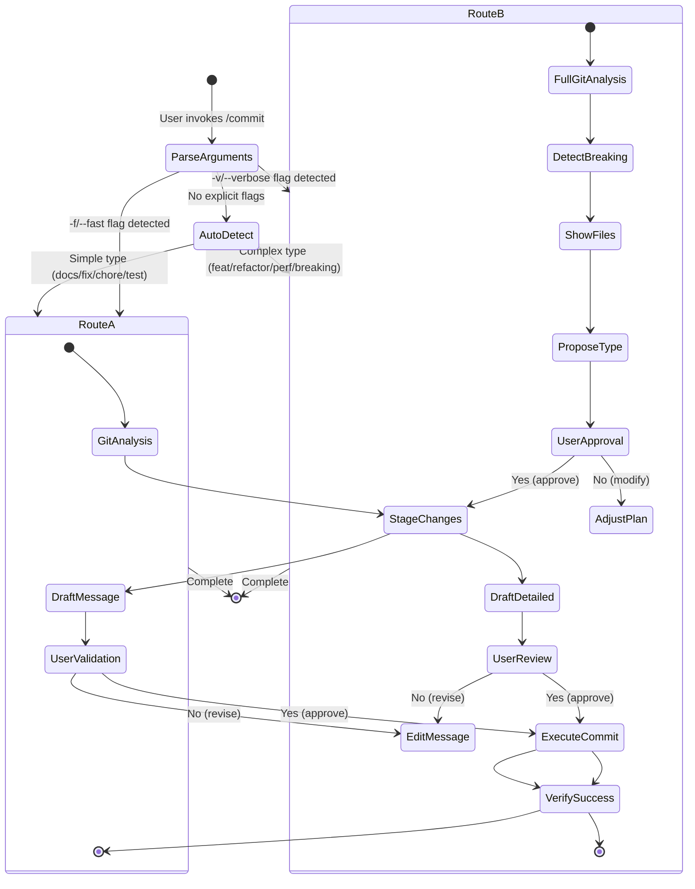
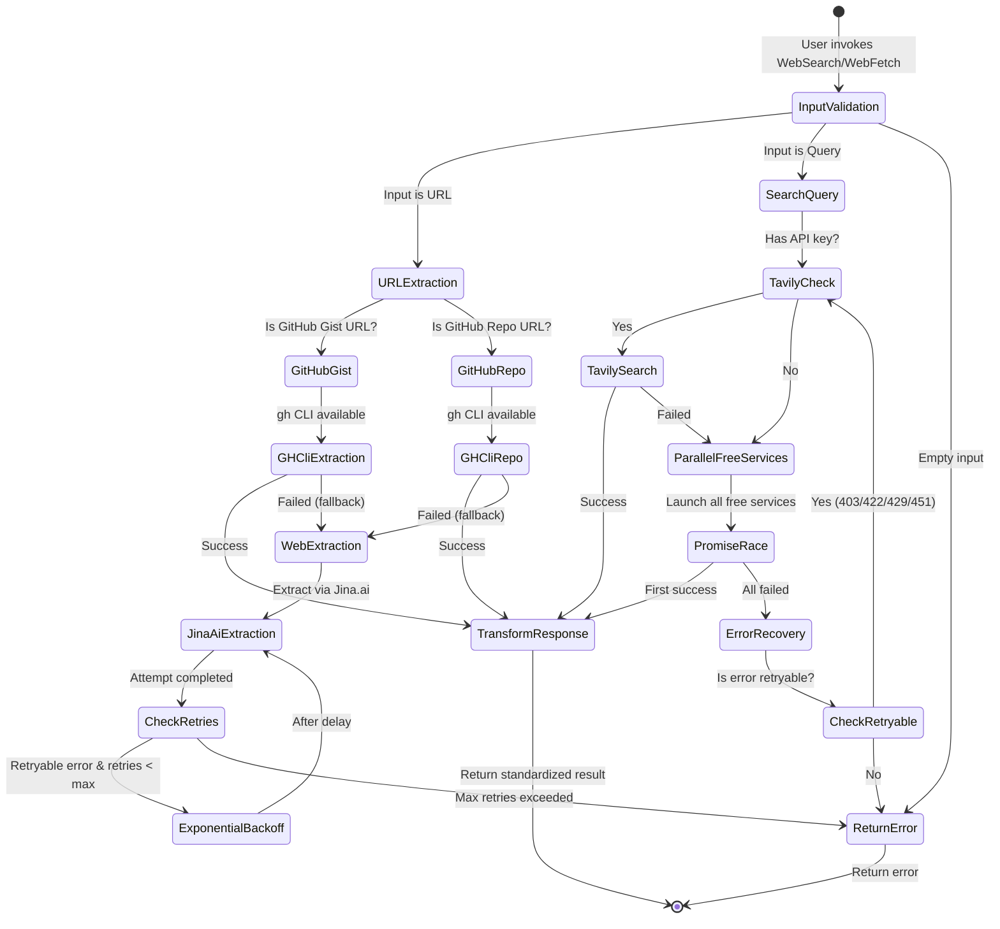
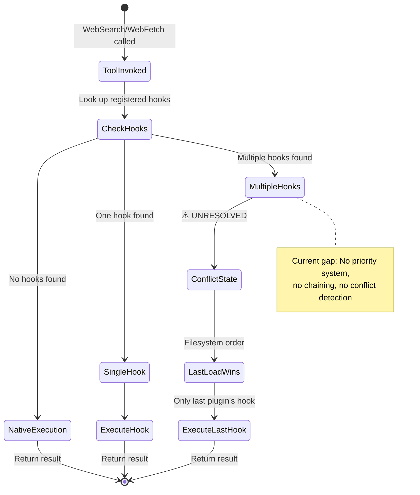
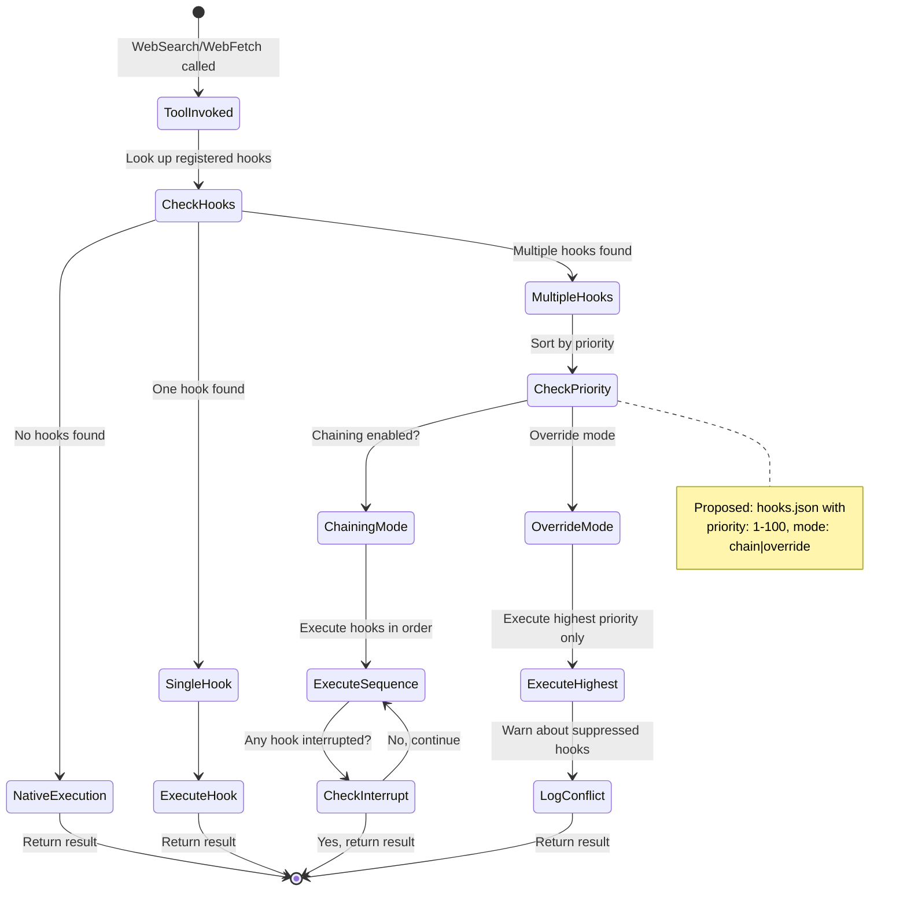

# VibeKit Plugin Marketplace - Architecture Review

## Overview

**Evaluation Type**: Architecture Analysis and State Machine Mapping
**Component**: VibeKit Claude Code Plugin Marketplace
**Plugins Analyzed**: Base v1.5.0, Search-Plus v1.2.0
**Review Date**: January 11, 2026
**Status**: COMPREHENSIVE REVIEW COMPLETE

## Table of Contents
- [Executive Summary](#executive-summary)
- [High-Level Architecture](#high-level-architecture)
- [Primary Data Flows](#primary-data-flows)
- [Critical Architecture Gaps](#critical-architecture-gaps)
- [Identified Edge Cases](#identified-edge-cases)
- [Improvement Opportunities](#improvement-opportunities)
- [Security Considerations](#security-considerations)
- [Technology Stack](#technology-stack)
- [Appendices](#appendices)
- [Next Steps](#next-steps)
- [References](#references)

---

## Executive Summary

VibeKit demonstrates a well-designed plugin marketplace architecture with clear component boundaries, comprehensive error handling, and strong documentation practices. The system prioritizes reliability and developer experience while maintaining security and modularity. However, several architectural gaps exist around inter-plugin communication, hook conflict resolution, and observability.

**Key Findings**:
- **Strengths**: Modular plugin system, robust fallback architecture in Search-Plus, excellent documentation
- **Critical Gaps**: No hook priority system, limited inter-plugin composability, missing health observability
- **Risk Profile**: Low-to-medium severity; current architecture supports 2 plugins but won't scale beyond 5-10 without addressing conflicts

---

## High-Level Architecture

### Component Summary

```
VibeKit Marketplace
├─ Plugin Registry (marketplace.json)
│  └─ Centralized metadata and version management
├─ Base Plugin (v1.5.0)
│  ├─ Git workflow automation (/commit, crafting-commits skill)
│  ├─ Workflow orchestration agent
│  └─ Architecture review command (/review-arch)
├─ Search-Plus Plugin (v1.2.0)
│  ├─ Enhanced web search with fallback cascade
│  ├─ PostToolUse hook interception
│  └─ Multi-provider support (Tavily, Brave, Bing, free APIs)
└─ Plugin Loading System
   └─ Manifest-based discovery (plugin.json, SKILL.md, hooks.json)
```

### Design Patterns

- **Plugin Marketplace Pattern**: Central registry with distributed plugin implementations
- **Hook Interception Pattern**: PostToolUse hooks extend built-in tools transparently
- **Fallback Cascade Pattern**: Search-Plus tries providers sequentially with error recovery
- **Stateless Execution**: No persistent layer; relies on git and environment variables
- **Documentation-Driven**: Markdown frontmatter for commands, SKILL.md for capabilities

---

## Primary Data Flows

### 1. Base Plugin Commit Workflow

```
User Input
    │
    ▼
① Parse Arguments ────(-f detected?)───→ Route A (Simple Mode)
    │                                           │
    ▼                                           ▼
(-v detected?)                          ② Git Analysis (status/diff/log)
    │                                           │
    ▼                                           ▼
Route B (Detailed Mode)          ③ Stage Changes → ④ Draft Commit
    │                                           │
    ▼                                           ▼
② Git Analysis (full)           ⑤ User Validation → (yes) → ⑦ Execute
    │                          (no) → Exit        │
    ▼                                             ▼
③ Detect Breaking              ⑦ Git Commit → ⑧ Verify → Success
    │
    ▼
④ Show Plan
    │
    ▼
⑤ User Approval ───(yes)───→ ⑥ Stage & Draft
    │
    (no) → Exit

Freedom Levels:
├─ L1: Autonomous (docs/fix/chore) → auto-proceed
├─ L2: Validation (feat/refactor) → user confirmation
└─ L3: Explicit (breaking) → full review cycle
```

**Key Decisions**:
- **Route selection** based on commit type determines validation depth
- **Breaking changes** trigger full review cycle regardless of flags
- **Co-Authored-By attribution** added automatically per AGENTS.md

**Mermaid State Machine (for GitHub/IDE rendering)**:



### 2. Search-Plus Query Flow

```
Hook Triggered (WebSearch/WebFetch)
    │
    ▼
① Validate Input ────(empty)───→ Return Error
    │
    ▼
② Detect Type
    │
    ├─(URL)───────────────────────┐
    │                             │
    ▼                             ▼
③ URL Extraction           ③ Search Query Detection
    │                             │
    ▼                             ▼
④ GitHub Gist?            ④ Tavily API Available?
    │                             │
    ├─(yes)→ gh gist view         ├─(yes)→ Try Tavily ──(success)→ Return
    │                             │
    ▼                             ▼
④ GitHub Repo?           (failed) → ⑤ Parallel Free Services
    │                             │
    ├─(yes)→ gh repo view         ├─ Launch SearXNG (×3 instances)
    │                             ├─ Launch DuckDuckGo
    ▼                             └─ Launch Startpage
④ Web Extraction               │
    │                             ▼
⑤ Extract Content          ⑥ Promise.any() Race
    │                             │
    ├─(retryable)───→ Backoff ────┼─(first success)→ Return Result
    │          ↑                   │
    └─(max retry)                 └─(all failed)→ Error Recovery
    │                             │
    ▼                             ▼
⑥ Return Result              ⑦ Handle Error ──(recoverable)→ Return
    │                                         │
    │                                         ▼
    │                                    (failed)→ Final Error
    │
    ▼
Exit

Note: Promise.any() = first service to return wins, all fail = reject
```

**Key Behaviors**:
- **GitHub CLI integration** for gist/repo URLs avoids rate limiting
- **Parallel free services** use `Promise.any()` for optimal latency
- **Retry with exponential backoff** for web extractions
- **Schema validation** ensures consistent output format

**Mermaid State Machine (for GitHub/IDE rendering)**:



### 3. Plugin Discovery and Loading

```
Claude Code Startup
    │
    ▼
① Read marketplace.json
    │
    ▼
② For Each Plugin:
    │
    ├─→ ③ Load plugin.json
    │        │
    │        ├─(invalid)──→ Skip Plugin → Next
    │        │
    │        └─(valid)────→ ④ Register Commands (commands/*.md)
    │                           │
    │                           ▼
    │                       ⑤ Parse Frontmatter Metadata
    │                           │
    │                           ▼
    │                       ⑥ Register Skills (skills/SKILL.md)
    │                           │
    │                           ▼
    │                       ⑦ Validate Skill Permissions
    │                           │
    │                           ▼
    │                       ⑧ Install Hooks (hooks/hooks.json)
    │                           │
    │                           ▼
    │                       ⑨ Register Agents (agents/)
    │                           │
    │                           └─→ Plugin Ready → Next Plugin
    │
    ▼
③ All Plugins Loaded
    │
    ▼
④ Resolve Dependencies
    │
    ├─(unmet)──→ Warning + Continue
    │
    └─(met)────→ System Ready

Current Gaps:
├─ No hook priority system (last loaded wins)
├─ No inter-plugin skill references
└─ Silent failures if manifest invalid
```

**Loading Characteristics**:
- **No compilation required** - pure plugin architecture
- **Independent versioning** per plugin
- **Silent failure** on invalid manifests (partial system state)
- **No dependency resolution** - references don't validate target exists

---

## Critical Architecture Gaps

### 1. Hook Conflict Resolution (Undefined)

```
┌─────────────────────────────────────────────────────────────────┐
│                 HOOK CONFLICT RESOLUTION                        │
│                    (Currently Undefined)                        │
└─────────────────────────────────────────────────────────────────┘

Tool Invoked (e.g., WebSearch)
    │
    ▼
① Check for Hooks
    │
    ├─(none)───→ Native Execution → Return Result
    │
    ├─(single)──→ Execute Hook → Return Result
    │
    └─(multiple)──→ ⚠️ CONFLICT STATE (UNRESOLVED)
                      │
                      ▼
                  Last Load Wins
                      │
                      └─→ Only last plugin's hook executes
                           │
                           └─→ Return Result

Problem Scenarios:
├─ Plugin A loads → hooks WebSearch
├─ Plugin B loads → hooks WebSearch
└─ Plugin C loads → hooks WebSearch
                  │
                  └─→ Only Plugin C's hook runs (A & B ignored)

Current Behavior:
├─ Filesystem order determines priority
├─ No composition/chaining of hooks
├─ No conflict detection or warnings
└─ Non-deterministic across different systems

**Mermaid State Machine (Current Behavior)**:



**Mermaid State Machine (Proposed Solution)**:



Desired (Not Implemented):
├─ Priority field in hooks.json
├─ Chaining option (hooks execute in sequence)
├─ Conflict detection + user warning
└─ Explicit override semantics
```

**Impact**: High - prevents adding plugins that extend overlapping tools

**Example**: If a new "database-query" plugin hooks `WebFetch` to optimize SQL queries, it will silently override Search-Plus's `WebFetch` hook with no warning.

### 2. Inter-Plugin Communication Barriers

**Current State**:
- Skills cannot reference capabilities from other plugins
- Agents cannot invoke other plugin's skills explicitly
- No shared utility layer across plugins

**Impact**: Medium - limits composability and forces code duplication

**Example**: If Base plugin wants to use Search-Plus's enhanced search within its agents, it must rely on Claude's built-in routing rather than explicit invocation.

### 3. Missing Observability

**Current Gaps**:
- No plugin health status endpoints
- No error rate tracking per plugin
- No performance metrics (latency, success rate)
- Silent failures on invalid manifests

**Impact**: Low-to-Medium - difficult to debug issues in production

---

## Identified Edge Cases

### Commit Workflow

| Edge Case | Current Behavior | Risk Level |
|-----------|------------------|------------|
| User approves → git fails (merge conflict) | No recovery path | Medium |
| Partial stage (some files fail to add) | Unclear commit state | Low |
| Pre-commit hook rejects commit | No automatic retry | Low |
| Breaking change with -f flag | Still prompts for approval | Low (intentional) |

### Search Fallback

| Edge Case | Current Behavior | Risk Level |
|-----------|------------------|------------|
| Tavily timeout + partial free results | Accepts low-quality data | Medium |
| All services return different formats | Schema validation gaps | Low |
| Rate limit on all free services | Returns final error | Low |
| GitHub CLI not installed | Falls back to web extraction | Low |

### Plugin Loading

| Edge Case | Current Behavior | Risk Level |
|-----------|------------------|------------|
| Plugin A valid, Plugin B invalid | A loads, B silent fail | Medium |
| Cyclic dependency references | Undefined behavior | High |
| Missing SKILL.md in skills/ | Plugin loads without skill | Low |
| Invalid hooks.json syntax | Plugin fails to load | Medium |

### Hook Conflicts

| Edge Case | Current Behavior | Risk Level |
|-----------|------------------|------------|
| Multiple plugins hook same tool | Filesystem-dependent execution | High |
| Hook crashes entire pipeline | No isolation/fault containment | Medium |
| Hook timeout exceeds Claude limit | Partial execution state | Low |

---

## Improvement Opportunities (Prioritized)

### Priority 1 (Critical)

1. **Implement hook priority system**
   - Rationale: Prevents silent conflicts as plugin ecosystem grows
   - Proposed solution: Add `priority: 1-100` field to hooks.json with chaining vs override semantics

2. **Design commit rollback mechanism**
   - Rationale: No recovery path for failed commits or accidental secrets
   - Proposed solution: Add `/base:rollback` command with pre-commit validation

### Priority 2 (High)

3. **Create plugin health observability**
   - Rationale: Difficult to debug issues without visibility into plugin status
   - Proposed solution: Add `/base:plugin-health` exposing load status, error counts, last-success timestamps

4. **Define inter-plugin dependency system**
   - Rationale: Skills cannot reference other plugins' capabilities
   - Proposed solution: Add `requires: ["plugin:capability"]` to plugin manifests with validation

### Priority 3 (Medium)

5. **Add automated testing pipeline**
   - Rationale: Docker tests exist but no CI automation
   - Proposed solution: GitHub Actions workflow running existing Docker tests on PRs

6. **Implement plugin version compatibility matrix**
   - Rationale: No tracking of which plugin versions work together
   - Proposed solution: Add `compatibleWith` field to marketplace.json

7. **Create plugin development CLI**
   - Rationale: Manual plugin validation is error-prone
   - Proposed solution: `npm run plugin:validate` and `npm run plugin:test` scripts

### Priority 4 (Low)

8. **Add skill discovery command**
   - Rationale: Users cannot list available skills without triggering them
   - Proposed solution: `/base:list-skills` command showing all available skills

9. **Implement plugin telemetry aggregation**
   - Rationale: No insight into which plugins/features are most used
   - Proposed solution: Optional anonymous usage tracking (opt-in only)

10. **Create plugin template generator**
    - Rationale: Starting new plugins requires copying existing structure
    - Proposed solution: `/base:new-plugin [name]` scaffolding command

---

## Security Considerations

### Current Security Posture

| Area | Status | Notes |
|------|--------|-------|
| API key storage | ✅ Secure | Environment variables, not committed |
| Hook permissions | ✅ Secure | Claude Code's tool permission system |
| Plugin isolation | ⚠️ Partial | Hooks can intercept but not modify tools |
| Dependency updates | ✅ Automated | Dependabot configured |
| Secret scanning | ⚠️ Manual | No automated pre-commit secret detection |

### Recommendations

1. **Add pre-commit secret scanning** to Base plugin's commit workflow
2. **Document hook security model** - clarify what hooks can/cannot access
3. **Implement plugin signing** - verify plugin integrity before loading
4. **Add rate limiting** to Search-Plus to prevent API abuse

---

## Technology Stack

| Component | Technology | Purpose |
|-----------|-----------|---------|
| Plugin runtime | Node.js | Hook scripts and utilities |
| Containerization | Docker | Multi-environment testing |
| CLI integration | GitHub CLI (gh) | Gist/repo content extraction |
| Documentation | Markdown | Plugin manifests and commands |
| Search providers | Tavily, Brave, Bing, SearXNG, DuckDuckGo, Startpage | Web search APIs |
| Version control | Git | State management and commit operations |

---

## Appendices

### Appendix A: Plugin File Structure

```text
.claude-plugin/
├── marketplace.json          # Central registry
└── plugins/
    ├── base/
    │   ├── .claude-plugin/
    │   │   ├── plugin.json   # Plugin manifest
    │   │   └── hooks.json    # Hook configurations
    │   ├── agents/           # Custom agents
    │   │   └── workflow-orchestrator.md
    │   ├── commands/         # Slash commands
    │   │   ├── commit.md
    │   │   └── review-arch.md
    │   └── skills/           # Auto-discoverable capabilities
    │       └── crafting-commits/
    │           ├── SKILL.md
    │           └── scripts/
    └── search-plus/
        ├── .claude-plugin/
        │   ├── plugin.json
        │   └── hooks.json
        ├── scripts/          # Hook implementations
        │   └── handle-web-search.mjs
        └── hooks/
            └── hooks.json    # PostToolUse configuration
```

### Appendix B: State Machine Notation Legend

```text
┌─ Boxes represent states or processes
│
├─ Arrows (→) show state transitions
│
├─ Diamond conditions (─→) show branching logic
│
└─ Parenthetical notes (condition) show transition triggers
```

---

## Next Steps

Based on this architecture review, I recommend we:

1. **Implement hook priority specification** - Add `priority: 1-100` field to hooks.json with chaining vs override semantics, plus conflict detection warnings. This is critical for scaling beyond 2 plugins.

2. **Create plugin health observability** - Add `/base:plugin-health` command exposing load status, error counts, last-success timestamps, and dependency graph. Essential for debugging production issues.

3. **Design commit rollback mechanism** - Add `/base:rollback` for undoing failed commits with pre-commit validation to catch accidental secrets or merge issues. Addresses critical recovery gap.

---

## References

- [Base Plugin README](../plugins/base/README.md)
- [Search-Plus Plugin README](../plugins/search-plus/README.md)
- [Marketplace Registry](../.claude-plugin/marketplace.json)
- [Base Plugin PRD](prd-006-base-plugin.md)
- [Search-Plus Enhancement PRD](prd-001-search-plus-enhancement.md)
- [Claude Code Best Practices](https://www.anthropic.com/engineering/claude-code-best-practices)
