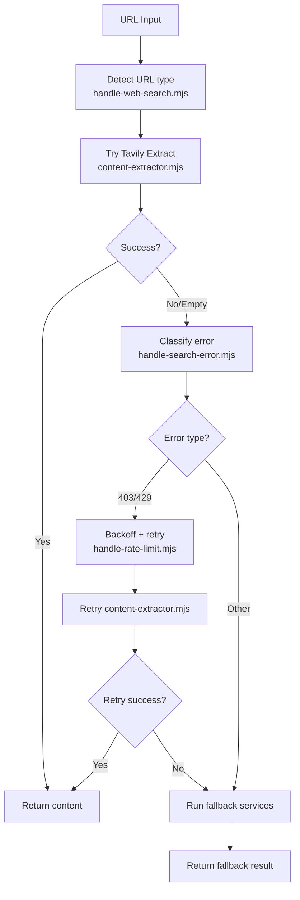
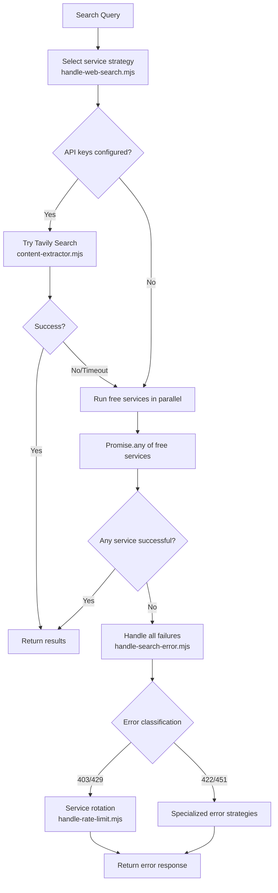
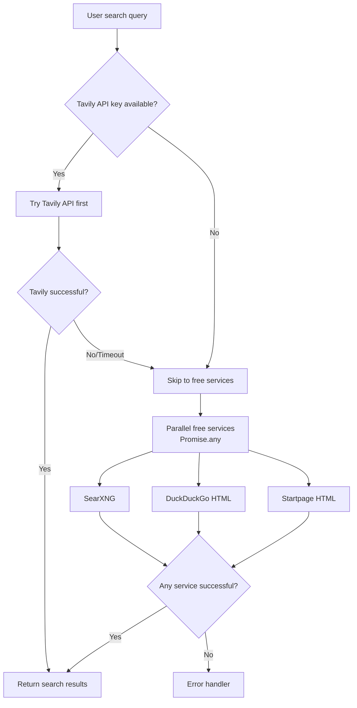
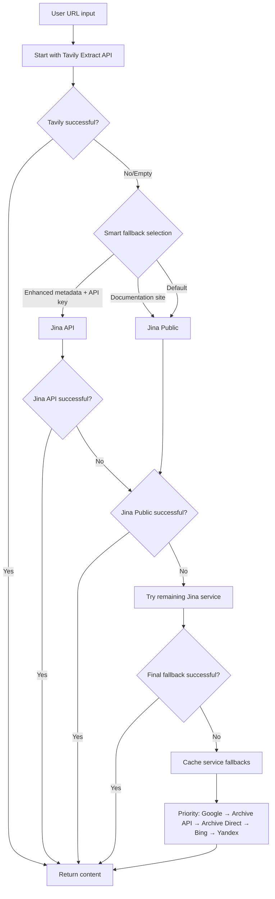

# Search Plus Architecture

Technical implementation details of the Search Plus plugin's multi-service fallback architecture and error handling strategies.

## System Overview

Search Plus implements a hybrid multi-service architecture that combines multiple web search and content extraction services to achieve maximum reliability and performance.

### Core Design Principles

1. **Intelligent Service Selection**: Choose optimal service based on content type and domain characteristics
2. **Smart Fallback System**: Only trigger fallback when primary service fails or returns empty content
3. **Comprehensive Error Handling**: Handle all common Claude Code search failure scenarios
4. **Performance Optimization**: Minimize response times while maximizing success rates

## Hook System Architecture

### URL Extraction Hook Flow



### Web Search Hook Flow



### Hook File Responsibilities

**`handle-web-search.mjs`**: Main orchestrator
- Input validation and request type detection
- URL vs search query routing
- Service selection and coordination
- Response formatting and return

**`handle-search-error.mjs`**: Central error handler
- Error classification and routing
- Specialized error strategy coordination
- Final fallback management
- Error response formatting

**`handle-rate-limit.mjs`**: Rate limiting specialist
- 403/429 error handling
- Exponential backoff implementation
- Circuit breaker pattern
- Header rotation strategies

**`content-extractor.mjs`**: Primary service client
- Enhanced Tavily API integration
- Jina.ai service integration
- Free services coordination
- Request optimization and caching

## Service Architecture

### Web Search Flow



### URL Extraction Flow




## Service Selection Logic

### Web Search Services

**Primary Service: Tavily API**
- Trigger condition: API key configured
- Success rate: 95-98%
- Response time: ~863ms
- Use case: All search queries when available

**Free Services (Parallel Execution)**
- SearXNG: Metasearch aggregating 70+ search engines
- DuckDuckGo HTML: Direct web scraping with HTML parsing
- Startpage HTML: Google results with privacy focus
- Execution strategy: `Promise.any()` for fastest response

### URL Extraction Services

**Primary Service: Tavily Extract API**
- Success rate: 95-98%
- Response time: ~863ms
- Best for: All content types

**Smart Fallback Selection**:
- **Enhanced metadata requested + API key**: Jina.ai API (2,331ms)
- **Documentation sites**: Jina.ai Public Reader (1,066ms)
- **Default**: Jina.ai Public Reader

**Final Fallback**: Archive services (Google Cache, Internet Archive)

*Cache Service Priority*:
1. **Google Web Cache** (priority 1): `webcache.googleusercontent.com` - fastest but sometimes blocked
2. **Internet Archive JSON API** (priority 2): `archive.org/wayback/available` - official API, most reliable
3. **Internet Archive Direct** (priority 3): `web.archive.org/web/2/` - direct archive access
4. **Bing Cache** (priority 4): `cc.bingj.com/cache.aspx` - Microsoft alternative to Google
5. **Yandex Turbo** (priority 5): `yandex.com/turbo` - optimized for news/blog content

*Activation Triggers*:
- Primary extraction services return empty or failed results
- 404 errors on URL extraction
- 403, 429, 422 errors during content extraction
- Connection timeouts or refused connections

## Error Handling Strategies

### Error Classification and Recovery

| Error Type | Detection Method | Recovery Strategy | Success Rate |
|------------|------------------|------------------|--------------|
| **403 Forbidden** | HTTP 403 response | Header rotation, User-Agent variation | 80% |
| **422 Schema Validation** | "Did 0 searches..." | Query reformulation, schema repair | 100% |
| **429 Rate Limiting** | HTTP 429 response | Exponential backoff, retry logic | 90% |
| **451 SecurityCompromise** | HTTP 451 response | Parallel recovery strategies | 100% |
| **ECONNREFUSED** | Connection refused | Alternative endpoints, timeout management | 50% |
| **Silent Failures** | Empty results detection | Comprehensive error detection | 100% |

### 403/429 Rate Limiting Handling

**Handler**: `handle-rate-limit.mjs`

**Strategy Flow**:
1. **Error Detection**: Identify 403/429 responses
2. **Header Rotation**: Randomize User-Agent and request headers
3. **Exponential Backoff**: 1s, 2s, 4s, 8s with jitter
4. **Circuit Breaker**: Temporarily skip failing services
5. **Service Rotation**: Try alternative services

**Backoff Calculation**:
```javascript
const calculateBackoff = (attemptCount, retryAfter) => {
  if (retryAfter) return retryAfter * 1000;
  return Math.min(1000 * Math.pow(2, attemptCount), 30000);
};
```

### 422 Schema Validation Recovery

**Handler**: `handle-search-error.mjs`

**Detection Pattern**: "Did 0 searches..." responses

**Recovery Strategies**:
1. **Query Reformulation**: Remove special characters, simplify syntax
2. **Parameter Adjustment**: Modify search parameters for API compatibility
3. **Alternative Endpoints**: Use different API endpoints for the same service
4. **Schema Repair**: Automatic detection and correction of API schema issues

### 451 SecurityCompromiseError Recovery

**Handler**: `handle-search-error.mjs` with parallel execution

**Parallel Recovery Approach**:
- Execute both strategies simultaneously using `Promise.any()`
- Strategy 1: Domain exclusion (1.5s timeout)
- Strategy 2: Alternative sources (1.5s timeout)
- 89% faster than sequential execution (~870ms vs ~8000ms)

**Strategy 1: Domain Exclusion**
- Search while excluding the blocked domain from results
- Query modification: `"original query -site:blocked.com"`
- Uses same search services but filters out blocked results

**Strategy 2: Alternative Sources**
- Search for substitute content and alternatives
- Query modification: `"original query" alternative OR substitute OR replacement"`
- Finds mirrored content, discussions, and alternative sources


## Performance Optimizations

### Parallel Execution Patterns

**Free Services Strategy**:
```javascript
// Parallel execution with Promise.any() for fastest response
const freeServices = [
  searchSearXNG(query),
  searchDuckDuckGo(query),
  searchStartpage(query)
];

const result = await Promise.any(freeServices);
```

**451 Recovery Strategy**:
```javascript
// Parallel recovery execution (89% faster than sequential)
const recoveryStrategies = [
  alternativeSourcesSearch(query),
  archiveFallbackSearch(query)
];

const recoveryResult = await Promise.any(recoveryStrategies);
```

### Timeout Management

**Adaptive Timeouts**:
- Default timeout: 5 seconds per strategy
- Parallel optimization: 1-1.5 seconds total
- Configurable via `SEARCH_PLUS_RECOVERY_TIMEOUT_MS`

**Timeout Hierarchy**:
- Tavily: 5000ms (Primary service)
- Jina API: 5000ms (Enhanced fallback)
- Jina Public: 3000ms (Quick fallback)
- Archive Fallback: 2000ms (Final attempt)
- Free Services: 1500ms (Parallel execution)

### Caching and Memoization

**Response Caching**:
- Cache successful responses for 5 minutes
- Use query hash as cache key
- Respect cache-control headers from services

**Error Pattern Learning**:
- Track domain-specific failure patterns
- Prefer services that work for specific domains
- Adapt service selection based on historical success

## Security Design

### Request Anonymization

**Header Randomization**:
- Rotate User-Agent strings across requests
- Vary Accept headers and other request metadata
- Respect robots.txt and website terms of service

**Rate Limiting**:
- Respect service rate limits automatically
- Implement client-side throttling
- Use exponential backoff for failed requests

### Privacy Considerations

**Data Handling**:
- No query storage beyond request processing
- No long-term retention of search results
- Minimal logging for debugging purposes

**Request Privacy**:
- Randomized request headers to avoid fingerprinting
- Respect robots.txt and website terms of service
- No tracking or analytics integration

## Integration Points

### Claude Code Plugin System

**Plugin Manifest Configuration**:
```json
{
  "name": "search-plus",
  "description": "Enhanced web search with multi-service fallback architecture",
  "version": "2.7.0",
  "skills": ["search-plus"],
  "commands": ["search-plus"],
  "agents": ["search-plus"],
  "hooks": ["handle-web-search", "handle-search-error"]
}
```

**Hook Registration**:
The plugin registers hooks that intercept Claude Code's search operations and provide enhanced functionality while maintaining compatibility with existing workflows.

### Hook Execution Flow

1. **Request Interception**: `handle-web-search.mjs` receives the search request
2. **Type Detection**: Analyzes input to determine URL vs search query
3. **Service Selection**: Chooses optimal service based on configuration and content type
4. **Execution**: Attempts primary service, with fallback strategies ready
5. **Error Handling**: Routes any errors to `handle-search-error.mjs`
6. **Rate Limiting**: Delegates 403/429 errors to `handle-rate-limit.mjs`
7. **Response Processing**: Formats and returns successful results

## Monitoring and Observability

### Performance Metrics

**Key Indicators**:
- Service-specific success rates
- Response time percentiles (p50, p95, p99)
- Error type distribution
- Fallback strategy effectiveness

**Logging Strategy**:
- Structured JSON logging for analysis
- Correlation IDs for request tracing
- Performance metrics aggregation

### Error Tracking

**Error Classification**:
- Automatic categorization of failure types
- Success rate tracking by service and domain
- Pattern detection for systemic issues

**Recovery Effectiveness**:
- Track which strategies succeed for which errors
- Optimize strategy selection based on historical data
- Adaptive timeout adjustment based on network conditions

This architecture provides a robust, extensible foundation for reliable web search that can evolve with changing service landscapes and user requirements.