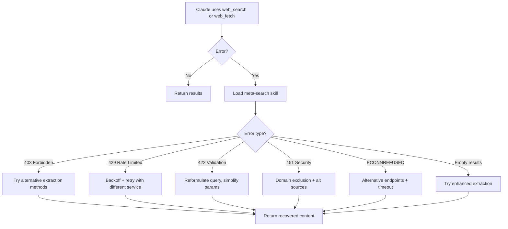

# Search Plus Architecture

Technical implementation details of the Search Plus plugin's architecture and error handling strategies.

> **Updated 2026-04-06** — Corrected to reflect actual runtime behavior. Previous versions documented an aspirational hook-driven script runtime that was never wired up. See [Appendix: Scripts Status](#appendix-scripts-status) for details.

## System Overview

Search Plus achieves reliable web search and content extraction through **instruction-driven architecture**: the `meta-search` skill (`SKILL.md`) provides Claude with error recovery strategies that it reasons through using its built-in `web_search` and `web_fetch` tools. The `search-plus` agent provides a structured operating procedure for complex multi-step research.

### How It Actually Works

```
User query or URL
       ↓
Claude encounters search/fetch error (403, 429, 422, etc.)
       ↓
Claude loads meta-search skill (SKILL.md instructions)
       ↓
Claude reasons through recovery strategies using built-in tools
       ↓
Successful content extraction
```

### Core Components

| Component | Path | Role |
|-----------|------|------|
| **meta-search skill** | `skills/meta-search/SKILL.md` | Error recovery instructions — the core value of the plugin |
| **search-plus agent** | `agents/search-plus.md` | Structured operating procedure for complex research |
| **hooks** | `hooks/hooks.json` | `PostToolUse` on `WebSearch\|WebFetch` — automated error recovery |
| **hook entry** | `skills/meta-search/scripts/hook-entry.mjs` | CLI entry point — reads stdin, detects errors, runs recovery |
| **scripts** | `skills/meta-search/scripts/*.mjs` | Tavily/Jina integration, error handling, response transformation |

### Core Design Principles

1. **Instruction-Driven Recovery**: Claude reads SKILL.md and reasons through error recovery using built-in tools
2. **Smart Fallback Strategy**: Skill instructs Claude to try multiple services in priority order
3. **Comprehensive Error Handling**: Covers 403, 429, 422, 451, ECONNREFUSED, and silent failures
4. **Agent Composition**: The `search-plus` agent loads the `meta-search` skill for its error handling

## Instruction-Driven Architecture

### Error Recovery Flow

When Claude encounters a search or fetch error, the `meta-search` skill provides instructions for recovery:


```mermaid
flowchart TD
    A[Claude uses web_search or web_fetch] --> B{Error?}
    B -->|No| C[Return results]
    B -->|Yes| D[Load meta-search skill]
    D --> E{Error type?}
    E -->|403 Forbidden| F[Try alternative extraction methods]
    E -->|429 Rate Limited| G[Backoff + retry with different service]
    E -->|422 Validation| H[Reformulate query, simplify params]
    E -->|451 Security| I[Domain exclusion + alt sources]
    E -->|ECONNREFUSED| J[Alternative endpoints + timeout]
    E -->|Empty results| K[Try enhanced extraction]
    F --> L[Return recovered content]
    G --> L
    H --> L
    I --> L
    J --> L
    K --> L
```

### Agent Operating Procedure

The `search-plus` agent follows a structured runbook:

1. **Interpret intent** — detect URL extraction vs open-ended research
2. **Choose path** — URL → extraction mode; no URL → research mode
3. **Primary attempt** — search/fetch using default tools
4. **Fallback gating** — trigger on HTTP ≥400, empty content, paywall/captcha
5. **Fallback sequence** — retry with backoff, switch service/provider
6. **Validate and dedupe** — require non-empty content, rank by relevance
7. **Summarize and cite** — produce concise answer with inline citations

## Service Strategy

The skill instructs Claude to use these services in priority order:

### Web Search Services

| Priority | Service | Notes |
|----------|---------|-------|
| 1 | Tavily API | Requires `SEARCH_PLUS_TAVILY_API_KEY` |
| 2 | SearXNG | Free, metasearch aggregator |
| 3 | DuckDuckGo | Free, HTML parsing |
| 4 | Startpage | Free, Google results with privacy |

### URL Extraction Services

| Priority | Service | Notes |
|----------|---------|-------|
| 1 | Tavily Extract API | Requires API key |
| 2 | Jina.ai API | Requires `SEARCH_PLUS_JINA_API_KEY` |
| 3 | Jina.ai Public Reader | Free |
| 4 | Cache services | Google Cache → Archive.org → Bing Cache → Yandex Turbo |

### GitHub Integration

When `SEARCH_PLUS_GITHUB_ENABLED=true` and `gh` CLI is installed, GitHub URLs are handled via native CLI access before falling back to web scraping.

## Error Handling Strategies

### Error Classification and Recovery

| Error Type | Detection | Recovery Strategy | Success Rate |
|------------|-----------|-------------------|--------------|
| **403 Forbidden** | HTTP 403 | Alternative extraction, header variation | ~80% |
| **422 Validation** | "Did 0 searches..." | Query reformulation, param simplification | ~100% |
| **429 Rate Limiting** | HTTP 429 | Exponential backoff, service rotation | ~90% |
| **451 Security** | HTTP 451 | Domain exclusion + alternative sources (parallel) | ~100% |
| **ECONNREFUSED** | Connection refused | Alternative endpoints, timeout adjustment | ~50% |
| **Silent Failures** | Empty results | Enhanced extraction, service switching | ~100% |

*Success rates measured in controlled testing. Real-world rates may vary.*

### 403/429 Recovery

1. Identify blocked domain/service
2. Retry with alternative extraction method
3. Apply exponential backoff (1s, 2s, 4s, 8s) with jitter
4. Rotate to different service provider
5. Try cache/archive services as last resort

### 422 Schema Validation Recovery

1. Detect "Did 0 searches..." response pattern
2. Remove special characters from query
3. Simplify request parameters
4. Try alternative API endpoint
5. Reattempt with reformulated query

### 451 SecurityCompromise Recovery

1. Exclude blocked domain from search: `"query -site:blocked.com"`
2. Search for alternative sources: `"query" alternative OR substitute`
3. Execute both strategies in parallel for speed

## Security Design

- **No query storage** beyond request processing
- **No tracking or analytics** integration
- **HTML sanitization** via `security-utils.mjs` (reference implementation in scripts)
- **URL validation** against SSRF patterns
- **Respects** robots.txt and website terms of service

## Configuration

See [CONFIGURATION.md](CONFIGURATION.md) for environment variables and setup.

Key variables:
- `SEARCH_PLUS_TAVILY_API_KEY` — Tavily API key (optional, enables primary service)
- `SEARCH_PLUS_JINA_API_KEY` — Jina.ai API key (optional, enables enhanced fallback)
- `SEARCH_PLUS_GITHUB_ENABLED` — Enable GitHub CLI integration (default: false)
- `SEARCH_PLUS_RECOVERY_TIMEOUT_MS` — Recovery timeout (default: 5000ms)

---

## Hook Runtime

The plugin registers a `PostToolUse` hook on `WebSearch|WebFetch` events. The hook runs `skills/meta-search/scripts/hook-entry.mjs`, a CLI entry point that:

1. Reads the PostToolUse JSON from stdin (`tool_name`, `tool_input`, `tool_response`)
2. Detects recoverable errors in the tool response (403, 429, 422, 451, ECONNREFUSED, empty results)
3. If an error is detected, delegates to `handleWebSearch()` for recovery via Tavily/Jina/free services
4. Outputs `additionalContext` JSON to stdout so Claude receives the recovered content

If no error is detected or recovery fails, the hook exits silently (exit 0) and does not interfere.

### Two-tier architecture

| Tier | Component | How it works |
|------|-----------|--------------|
| **Instruction-driven** | `meta-search` skill (SKILL.md) | Claude reads recovery strategies and reasons through them using built-in tools. Works standalone. |
| **Hook-driven** | `hook-entry.mjs` → `handleWebSearch()` | Automated recovery that intercepts errors and injects recovered content. Requires the plugin. |

When both are active, the hook provides automated recovery while the skill provides Claude with strategies for cases the hook doesn't cover.
