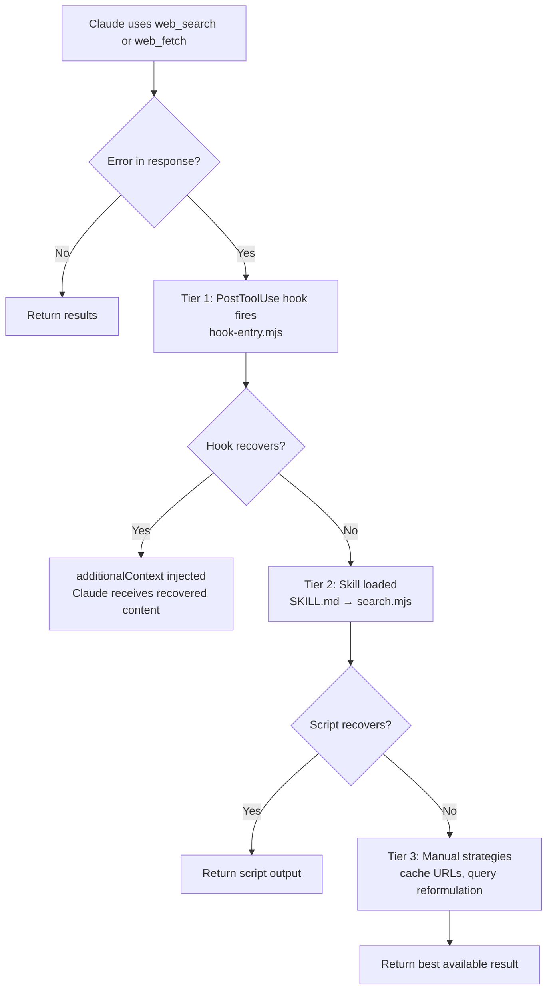

# Search Plus Architecture

Technical implementation details of the Search Plus plugin's architecture and error handling strategies.

> **Updated 2026-10-07** — Three-tier architecture with working hook and script orchestration, now covering `PostToolUseFailure` and the keyless Firecrawl/Defuddle/Wayback fallbacks. Previous versions documented aspirational flows that were never wired up.

## System Overview

Search Plus achieves reliable web search and content extraction through a **three-tier architecture**: an automated PostToolUse/PostToolUseFailure hook, a skill that orchestrates bundled multi-provider scripts, and manual fallback strategies using built-in tools. The `search-plus` agent provides a structured operating procedure for complex multi-step research.

### Core Components

| Component | Path | Role |
|-----------|------|------|
| **meta-search skill** | `skills/meta-search/SKILL.md` | Orchestrates recovery — runs scripts, then manual fallback |
| **search CLI** | `skills/meta-search/scripts/search.mjs` | CLI wrapper for skill invocation (query/URL as args) |
| **hook entry** | `skills/meta-search/scripts/hook-entry.mjs` | CLI entry point for PostToolUse / PostToolUseFailure — reads stdin, detects errors |
| **search-plus agent** | `agents/search-plus.md` | Structured operating procedure for complex research |
| **hooks** | `hooks/hooks.json` | `PostToolUse` + `PostToolUseFailure` on `WebSearch\|WebFetch` — automated error recovery |
| **scripts** | `skills/meta-search/scripts/*.mjs` | Multi-provider integration (Tavily/Brave/Exa/Jina/Firecrawl/Defuddle/Wayback), error handling, response transformation |

### Three-Tier Error Recovery

```mermaid
flowchart TD
    A[Claude uses web_search or web_fetch] --> B{Error in response?}
    B -->|No| C[Return results]
    B -->|Yes| D["Tier 1: PostToolUse hook fires<br/>hook-entry.mjs"]
    D --> E{Hook recovers?}
    E -->|Yes| F["additionalContext injected<br/>Claude receives recovered content"]
    E -->|No| G["Tier 2: Skill loaded<br/>SKILL.md → search.mjs"]
    G --> H{Script recovers?}
    H -->|Yes| I[Return script output]
    H -->|No| J["Tier 3: Manual strategies<br/>cache URLs, query reformulation"]
    J --> K[Return best available result]
```

> The hook registers both `PostToolUse` and `PostToolUseFailure` (see `hooks/hooks.json`), so it intercepts both successful tool calls whose response contains an error (403, 429, etc.) and tool-level exceptions — such as network timeouts before the tool returns. When automated recovery fails, the skill's manual strategies (Tier 3) cover the remaining cases.

### Agent Operating Procedure

The `search-plus` agent follows a structured runbook:

1. **Interpret intent** — detect URL extraction vs open-ended research
2. **Choose path** — URL → extraction mode; no URL → research mode
3. **Primary attempt** — search/fetch using default tools
4. **Fallback gating** — trigger on HTTP ≥400, empty content, paywall/captcha
5. **Fallback sequence** — advance to the next provider in the chain; each fetch is bounded by `AbortSignal.timeout` (no backoff/sleeps)
6. **Validate and dedupe** — require non-empty content, rank by relevance
7. **Summarize and cite** — produce concise answer with inline citations

## Service Strategy

The skill instructs Claude to use these services in priority order:

### Web Search Services

| Priority | Service | Notes |
|----------|---------|-------|
| 1 | Tavily API | Requires `SEARCH_PLUS_TAVILY_API_KEY` |
| 2 | Brave Search API | Requires `SEARCH_PLUS_BRAVE_API_KEY` |
| 3 | Exa AI Search | Requires `SEARCH_PLUS_EXA_API_KEY` |
| 4 | Jina.ai Search API | Requires `SEARCH_PLUS_JINA_API_KEY` |
| 5 | Firecrawl Search | Keyless tier — no key required; `SEARCH_PLUS_FIRECRAWL_API_KEY` raises limits |

### URL Extraction Services

| Priority | Service | Notes |
|----------|---------|-------|
| 1 | Direct markdown fetch | Free probe of the origin with `Accept: text/markdown`; used only on a 200 `text/markdown` response, otherwise falls through silently |
| 2 | Tavily Extract API | Requires API key |
| 3 | Jina.ai Reader | Free public reader, 20 RPM; API variant used when `SEARCH_PLUS_JINA_API_KEY` is set and enhanced metadata is requested |
| 4 | Firecrawl | Keyless tier — no key required; `SEARCH_PLUS_FIRECRAWL_API_KEY` raises limits |
| 5 | Defuddle | Keyless URL → markdown via `defuddle.md` |
| 6 | Wayback Machine | Archived snapshot; snapshots are read via Defuddle since r.jina.ai is blocked for web.archive.org until 2035 |

### GitHub Integration

When `SEARCH_PLUS_GITHUB_ENABLED=true` and `gh` CLI is installed, GitHub URLs are handled via native CLI access before falling back to web scraping.

## Error Handling Strategies

### Provider Fallback

Each provider runs in its own try/catch; a failure (403, 429, 451, timeout, empty
result) falls through to the next provider in the chain — search: Tavily → Brave →
Exa → Jina → Firecrawl keyless; URL extraction: direct markdown probe → Tavily →
Jina → Firecrawl → Defuddle → Wayback. There is no same-provider retry or
backoff: the hook's 25s internal deadline (inside Claude Code's 30s hook budget)
makes long sleeps unshippable, and per-fetch `AbortSignal.timeout` bounds every
request.

### All-Providers-Failed

When every search provider fails, the CLI prints a structured failure summary to
stderr and exits 1; stdout stays empty. URL extraction additionally reports an
explicit "Tried:" list of every provider attempted and its error.

### Hook Failure Recovery

The hook never parses page text. It detects recoverable failures from structured
fields only — `PostToolUseFailure` error codes (403, 404, 422, 429, 451, 5xx),
`WebFetch` responses with `code >= 400`, and `WebSearch` responses reporting zero
searches or containing no result links — then runs a fresh chain and injects the
recovered content as `additionalContext`, capped at 9,500 characters. On no
failure, or failed recovery, it exits 0 silently.

## Security Design

- **No query storage** beyond request processing
- **No tracking or analytics** integration
- **HTML sanitization** via `security-utils.mjs` (reference implementation in scripts)
- **URL validation** against SSRF patterns
- **Respects** robots.txt and website terms of service

## Configuration

See [CONFIGURATION.md](CONFIGURATION.md) for environment variables and setup.

Key variables:
- `SEARCH_PLUS_TAVILY_API_KEY` — Tavily API key (optional, enables primary service)
- `SEARCH_PLUS_JINA_API_KEY` — Jina.ai API key (optional, enables enhanced fallback)
- `SEARCH_PLUS_BRAVE_API_KEY` — Brave Search API key (optional, $5 free credits/month)
- `SEARCH_PLUS_EXA_API_KEY` — Exa AI API key (optional, 1,000 free searches/month)
- `SEARCH_PLUS_FIRECRAWL_API_KEY` — Firecrawl API key (optional; search and extraction work keyless, key raises limits)
- `SEARCH_PLUS_GITHUB_ENABLED` — Enable GitHub CLI integration (default: false)
- `SEARCH_PLUS_DEBUG` — Set to `1` to print progress logs to stderr from the scripts (default: off)

---

## Hook Runtime

The plugin registers `PostToolUse` and `PostToolUseFailure` hooks on `WebSearch|WebFetch` events. Both run `skills/meta-search/scripts/hook-entry.mjs`, a CLI entry point that:

1. Reads the hook JSON from stdin (`tool_name`, `tool_input`, `tool_response` — or the error payload for `PostToolUseFailure`)
2. Detects recoverable failures from structured fields only, never page text: `PostToolUseFailure` error codes (403, 404, 422, 429, 451, 5xx), `WebFetch` responses with `code >= 400`, and `WebSearch` responses that report zero searches or contain no result links
3. If a failure is detected, delegates to `handleWebSearch()` for recovery via the multi-provider chain (search: Tavily → Brave → Exa → Jina → Firecrawl keyless; URL extraction: direct markdown probe → Tavily → Jina → Firecrawl → Defuddle → Wayback)
4. Outputs `additionalContext` JSON to stdout so Claude receives the recovered content

Progress logs go to stderr and only when `SEARCH_PLUS_DEBUG=1` — stdout is reserved for the hook JSON. Injected context is capped at 9,500 characters (Claude Code caps `additionalContext` at 10,000), and the script self-terminates after 25 seconds so it always exits inside the 30-second hook budget.

If no failure is detected or recovery fails, the hook exits silently (exit 0) and does not interfere.

### Three-tier architecture

| Tier | Trigger | Component | How it works |
|------|---------|-----------|--------------|
| **1. Hook** | Automatic on `PostToolUse` error | `hook-entry.mjs` → `handleWebSearch()` | Automated recovery — intercepts errors, injects `additionalContext`. Silent on success. |
| **2. Skill** | Claude auto-loads or user invokes `/search-plus:meta-search` | `SKILL.md` → `search.mjs` | Runs `node ${CLAUDE_SKILL_DIR}/scripts/search.mjs <query>`. Same multi-provider pipeline as hook. |
| **3. Manual** | Skill Step 2 fallback | Built-in `web_search`/`web_fetch` | Cache URLs, query reformulation, domain exclusion — strategies Claude executes with its own tools. |

All three tiers use the same underlying scripts. The hook and skill both call `handleWebSearch()` — the difference is the trigger (automatic vs explicit) and the interface (stdin JSON vs CLI args).

**Coverage**: The hook registers both `PostToolUse` (successful tool call with error in response) and `PostToolUseFailure` (tool-level exceptions such as timeouts), so both paths trigger automated recovery. When recovery fails, the skill's manual strategies cover the remaining cases.
